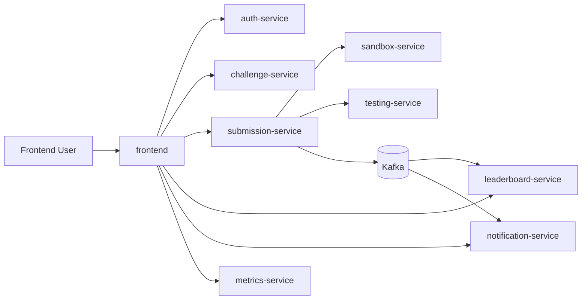

# API Arena

Plataforma educativa para aprender desarrollo de APIs REST mediante retos prácticos, evaluación automática y progresión competitiva (XP/ELO, leaderboard, notificaciones y replay técnico de submissions).

## Qué es API Arena

API Arena está pensada para que una persona pueda:

- elegir un challenge,
- implementar su API,
- enviar su solución en ZIP,
- obtener evaluación automática real contra HTTP,
- revisar resultados, ranking y trazabilidad del pipeline.

No es solo un CRUD de ejercicios: incluye pipeline de build/testing, mensajería con Kafka, notificaciones en tiempo real y observabilidad técnica.

## Estado actual del proyecto

- Núcleo funcional end-to-end en Docker.
- Arquitectura de microservicios desplegada.
- Sandbox con runner DinD por submission (con fallback).
- Replay estructurado persistido y consumido por frontend.
- Stack de métricas con Prometheus + Grafana.

Resumen operativo detallado en:

- `docs/TECHNICAL-OVERVIEW.md`
- `docs/P1-HARDENING-IMPLEMENTATION.md`
- `docs/E2E-DEBUG-GUIDE.md`
- `.cursor/rules/api-arena-project-progress.mdc`

## Stack tecnológico

### Frontend

- React 19 + Vite
- React Router
- CSS del producto (tokens de marca)
- Nginx para serving de build

### Backend

- Java 21 + Spring Boot 3.5.x
- Spring Security (JWT)
- Spring Data JPA
- Kafka
- Actuator + Prometheus
- Swagger/OpenAPI

### Infra y datos

- PostgreSQL 16
- Redis 7
- Kafka + Zookeeper
- MongoDB (disponible, integración limitada)
- InfluxDB (disponible, integración opcional)
- Prometheus + Grafana
- Docker Compose

## Microservicios

| Servicio | Puerto | Estado | Rol principal |
|---|---:|---|---|
| `auth-service` | 8081 | Activo | Registro/login, JWT, verificación email, perfiles, recompensas |
| `challenge-service` | 8082 | Activo | CRUD de challenges y metadatos de evaluación |
| `submission-service` | 8083 | Activo | Orquestación pipeline, estado/logs, replay timeline |
| `sandbox-service` | 8084 | Activo | Build/ejecución aislada (runner `process`/`dind`) |
| `testing-service` | 8085 | Activo | Evaluación funcional/performance/diseño contra API candidata |
| `leaderboard-service` | 8087 | Activo | Rankings globales y por challenge |
| `metrics-service` | 8089 | Activo | KPIs agregados y métricas de producto/pipeline |
| `notification-service` | 8090 | Activo | Notificaciones in-app + WebSocket + mirror email (IMPORTANT) |

Servicios reservados/futuros:

- `ai-review-service` (8086)
- `multiplayer-service` (8088)

## Arquitectura (alto nivel)



## Puertos y accesos

| Componente | Puerto | URL |
|---|---:|---|
| Frontend | 3000 | [http://localhost:3000](http://localhost:3000) |
| Grafana | 3001 | [http://localhost:3001](http://localhost:3001) |
| Auth | 8081 | [http://localhost:8081](http://localhost:8081) |
| Challenge | 8082 | [http://localhost:8082](http://localhost:8082) |
| Submission | 8083 | [http://localhost:8083](http://localhost:8083) |
| Sandbox | 8084 | [http://localhost:8084](http://localhost:8084) |
| Testing | 8085 | [http://localhost:8085](http://localhost:8085) |
| Leaderboard | 8087 | [http://localhost:8087](http://localhost:8087) |
| Metrics | 8089 | [http://localhost:8089](http://localhost:8089) |
| Notification | 8090 | [http://localhost:8090](http://localhost:8090) |
| Prometheus | 9090 | [http://localhost:9090](http://localhost:9090) |
| PostgreSQL | 5432 | `localhost:5432` |
| Redis | 6379 | `localhost:6379` |
| Kafka | 9092 | `localhost:9092` |

## Inicio rápido (Docker)

### Requisitos

- Docker Desktop (o Docker Engine + Compose v2).
- Recomendado: 6+ GB RAM disponibles para contenedores.
- Puertos anteriores libres en local.

### 1) Clonar

```bash
git clone <repo-url>
cd API-ARENA
```

### 2) Configurar entorno

```bash
cp .env.example .env
```

Si ya tienes `.env`, revisa valores y secretos antes de levantar.

### 3) Levantar stack completo

```bash
docker compose up -d --build
```

### 4) Verificar salud

```bash
docker compose ps
```

Todos los servicios principales deben quedar en `healthy` o `up`.

## Comandos útiles

### Logs

```bash
docker compose logs -f
docker compose logs -f submission-service
docker compose logs -f sandbox-service
```

### Rebuild selectivo (según cambios)

```bash
# Frontend
docker compose up -d --build frontend

# Servicios de pipeline
docker compose up -d --build sandbox-service submission-service testing-service

# Todo el stack
docker compose up -d --build
```

### Parar / limpiar

```bash
docker compose down
docker compose down -v
```

## Desarrollo local (sin Docker completo)

Puedes trabajar levantando solo dependencias:

```bash
docker compose up -d postgres redis kafka zookeeper
```

Y correr servicios desde IDE/terminal con `mvn spring-boot:run`.

Frontend:

```bash
cd frontend
npm install
npm run dev
```

## API docs y testing

- Swagger UI por servicio (`/swagger-ui.html`).
- Colección Postman: `backend/API-ARENA_Postman_Collection.json`.

## Transparencia de despliegue y límites actuales

Este repositorio está optimizado para entorno local/dev y demos técnicas, no como despliegue productivo cerrado.

Aspectos importantes:

- El despliegue oficial aquí es vía `docker-compose.yml`.
- El runner DinD está operativo, pero endurecimiento de aislamiento para producción estricta sigue en roadmap.
- Existen contenedores opcionales (Mongo/Influx) con integración parcial.
- Persistencia local y seeds pueden desalinearse en entornos que arrastran volúmenes antiguos.

Para detalles operativos reales:

- `docs/P1-HARDENING-IMPLEMENTATION.md`
- `docs/E2E-DEBUG-GUIDE.md`

## Estructura del repo

```text
API-ARENA/
├── backend/
│   ├── auth-service/
│   ├── challenge-service/
│   ├── submission-service/
│   ├── sandbox-service/
│   ├── testing-service/
│   ├── leaderboard-service/
│   ├── notification-service/
│   ├── metrics-service/
│   ├── API-ARENA_Postman_Collection.json
│   └── README_INICIO.md
├── frontend/
├── docker/
│   ├── postgres/
│   ├── prometheus/
│   └── grafana/
├── docs/
├── docker-compose.yml
└── README.md
```

## Credenciales seed (entorno local)

Definidas en `docker/postgres/init-db.sql` y en el documento de progreso:

- `arclight@apiarena.dev` / `Arena2025!`
- `byterunner@apiarena.dev` / `Arena2025!`
- `profoak@apiarena.dev` / `Arena2025!`
- `sysop@apiarena.dev` / `Arena2025!`

Si no funcionan en tu entorno actual, revisa `docs/E2E-DEBUG-GUIDE.md`.

## Troubleshooting rápido

### Puerto ocupado

```bash
lsof -ti:3000 | xargs kill -9
```

### Servicio no healthy

```bash
docker compose logs -f <service>
docker compose restart <service>
```

### Reset completo local

```bash
docker compose down -v
docker compose up -d --build
```

## Roadmap corto

- Hardening adicional de sandbox DinD.
- Replay avanzado (retención, compresión, timeline enriquecido).
- Dashboards de negocio más completos.
- Automatización E2E continua.

## Contribuir

1. Crea rama: `feature/<topic>` o `fix/<topic>`.
2. Haz commits claros en inglés.
3. Abre PR con resumen y plan de pruebas.

## Licencia / contexto

Proyecto en contexto académico (TFG) con evolución hacia producto demostrable/publicable.  
Antes de redistribuir o desplegar públicamente, revisa políticas/licencia vigentes del repositorio.
